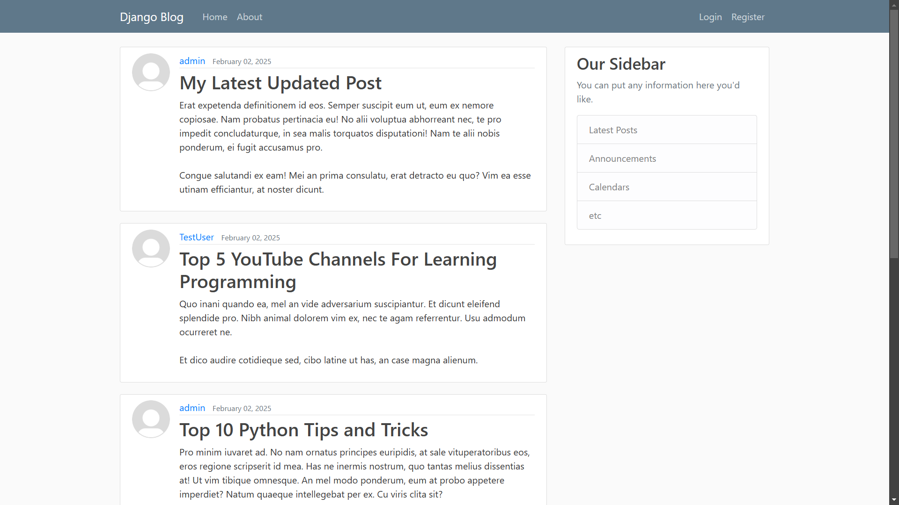
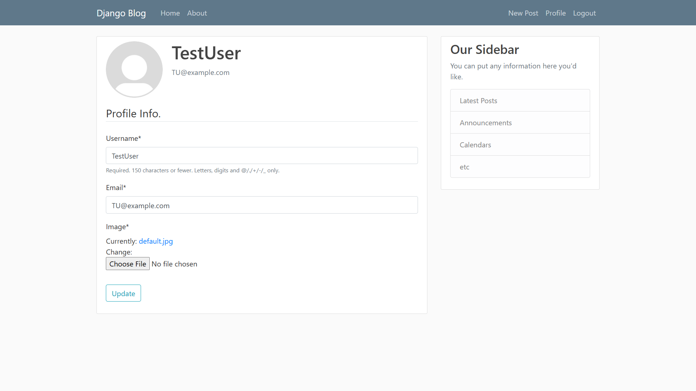

# Django Blog Application

Welcome to **Django Blog Application**! This project is a fully functional blog platform built with Django. It's a great foundation for anyone looking to delve into web development with Python and Django.

## Table of Contents

- [Django Blog Application](#django-blog-application)
  - [Table of Contents](#table-of-contents)
  - [Overview](#overview)
  - [Features](#features)
  - [Installation](#installation)
    - [Prerequisites](#prerequisites)
    - [Clone the Repository](#clone-the-repository)
    - [Set Up a Virtual Environment](#set-up-a-virtual-environment)
    - [Install Dependencies](#install-dependencies)
    - [Provide Your Secret Keys](#provide-your-secret-keys)
    - [Make and Apply Migrations](#make-and-apply-migrations)
    - [Create a Superuser](#create-a-superuser)
    - [Run the Development Server](#run-the-development-server)
  - [Usage](#usage)
  - [Screenshots](#screenshots)

## Overview

This application allows users to register, log in, create posts, update their profiles, and interact with other users' content. It implements essential web development concepts and showcases how to build a scalable and maintainable web application using Django.

## Features

- **User Authentication**: Sign up, log in, log out, and password reset via email.
- **User Profiles**: Update profile information and upload profile pictures.
- **Blog Posts**: Create, read, update, and delete posts with ease.
- **Pagination**: Navigate through posts smoothly with paginated views.
- **Bootstrap Integration**: A clean, responsive design using Bootstrap 4.
- **Class-Based Views**: Efficient and organized views for handling requests.
- **Rich Text Editing**: Enhance posts with formatted text using Django Crispy Forms.

## Installation

Get a local copy up and running by following these steps.

### Prerequisites

Ensure you have the following installed:

- **Python 3.x**
- **pip** (Python package manager)
- **Virtualenv** (optional but recommended for managing dependencies)

### Clone the Repository

```bash
git clone https://github.com/VishalBhunjia/blog-django.git
cd blog-django
```

### Set Up a Virtual Environment

It's best practice to use a virtual environment.

```bash
python -m venv venv
```

Activate the virtual environment:

- On macOS/Linux:

    ```bash
    source venv/bin/activate
    ```

- On Windows:

    ```bash
    venv\Scripts\activate
    ```

### Install Dependencies

```bash
pip install -r requirements.txt
```

### Provide Your Secret Keys

```bash
python manage.py shell
>>>from django.core.management.utils import get_random_secret_key  
>>>get_random_secret_key()
```
Copy the generated key then exit the shell using 'exit()'.
Create a .env file in the project directory and paste the key in the format below:

```bash
SECRET_KEY=<Paste your genrated key here>
EMAIL_HOST_USER=<Your gmail username>
EMAIL_HOST_PASSWORD=<Your google App Password>
```
You can generate a Google app password [here](https://myaccount.google.com/apppasswords).


### Make and Apply Migrations

Set up the database schema.
```bash
python manage.py makemigrations
python manage.py migrate
```

### Create a Superuser

Create an admin account to access the Django admin panel.

```bash
python manage.py createsuperuser
```

### Run the Development Server

```bash
python manage.py runserver
```

Visit `http://127.0.0.1:8000/` in your web browser to view the app.

## Usage

- **Register** a new account or **log in** if you already have one.
- **Create new posts** by navigating to the "New Post" section.
- **Update your profile** by clicking on "Profile".
- **Admin Panel** can be accessed by visiting `http:127.0.0.1:8000/admin`.

## Screenshots


*The homepage displaying recent posts.*


*Creating a new blog post.*


*User profile page with the option to update information.*

---